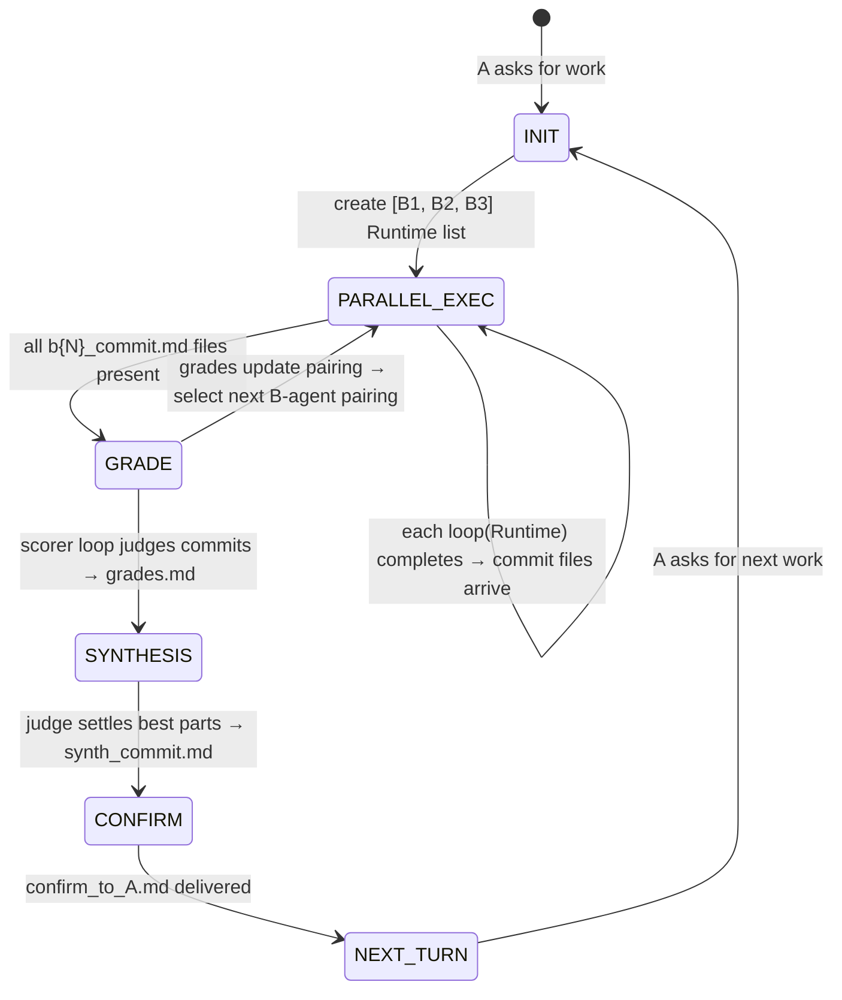

# Arity Harness State Transition Diagram

```mermaid
stateDiagram-v2
    [*] --> INIT: A asks for work
    INIT --> PARALLEL_EXEC: create [B1, B2, B3] Runtime list
    PARALLEL_EXEC --> PARALLEL_EXEC: each loop(Runtime) completes → commit files arrive
    PARALLEL_EXEC --> GRADE: all b{N}_commit.md files present
    GRADE --> SYNTHESIS: scorer loop judges commits → grades.md
    SYNTHESIS --> CONFIRM: judge settles best parts → synth_commit.md
    CONFIRM --> NEXT_TURN: confirm_to_A.md delivered
    NEXT_TURN --> INIT: A asks for next work
    GRADE --> PARALLEL_EXEC: grades update pairing → select next B-agent pairing
```

The filesystem is the handoff: commit files, `grades.md`, `synth_commit.md`, and `confirm_to_A.md` carry state between loop invocations.
