# BRIEF — v0 implementation of Arity (A/B/C, same brief to three houses)

> Provenance note: project-name tokens in this brief and its tracked relay copies were
> canonicalized to Arity; task contents, results, timings, and identities are otherwise unchanged.

wiki-snapshot: sha256:e2b271d3a57ff78d  (axioms, core, components, spine, tier-two, methods — inlined below)

## The task

Write a v0 implementation of the whole Arity system in Python 3.13, standard library only
(urllib for HTTP, no pip installs), as a SMALL SET OF MODULES in the directory you were given,
so pieces can be cherry-picked across houses. Under 1,500 lines total. Suggested split (rename
if you have a better cut): store.py, ledger.py, roles.py, tiers.py, cadence.py, scorecard.py,
harness.py, kernel.py, archivist.py, redphone.py, cast.py, pulse.py, demo.py — plus an
__init__.py. Fewer files is fine; one file is not.

Hard rules:
- NO FAKES. A harness is a for-loop around a real POST /chat/completions call (OpenAI-compatible
  dialect) that executes tool calls until there are none. Every kernel turn is a real call.
- Seats come from the environment. Seed the ledger from whichever of these exist:
  GEMINI_API_KEY -> https://generativelanguage.googleapis.com/v1beta/openai (models: gemini-3.6-flash, gemini-3.5-flash-lite; provider "gemini"),
  NVIDIA_NIM_API_KEY -> https://integrate.api.nvidia.com/v1 (model: nvidia/nemotron-3-nano-30b-a3b; provider "nim"),
  OPENROUTER_API_KEY -> https://openrouter.ai/api/v1 (provider "openai"). The kernel never sees a key.
- Use the axiom-7 cache table (windows, read/write multipliers, prices) as data.
- Roles are denial sets (tools, channels, paths, names, hosts). Tiers are compiled briefs that
  REFUSE if a denied path or name leaks in. Every kernel has an identity tuple
  (provider, endpoint, model, cache_boundary, session, hash(brief)). Kernels write their own
  report before dying; the archivist writes an impartial entry that checks claims against the
  tool log; if the report is absent, the entry says so. The archivist's findings are recorded
  to the scorecard, and standing goes DOWN when a model is caught claiming changes it never made.
- Handoffs are structured records posted to channels, bounded by depth and budget. A record may
  land in a channel the sender may not chat in; the reply returns the same way.
- The pulse: keepalive while p(return) * cold_cost > ping_cost; otherwise let the kernel die.
  The keepalive text is "hi luv u". No kernel is told the hour it would die.
- Presence: a seat a human is live on is never chosen for a fresh cast.

Deliverables:
1. The modules.
2. demo.py that, when run as `python demo.py`, plays these five stories against the real seats
   and prints a log: S1 (Asa DMs the voice "make a tiny brokie schema: one table `deals` with
   name, vendor, free_tier, url. write it to brokie/schema.sql"; the voice hands off to a
   builder which writes the file in a workspace dir; archivist verifies), S3 (a second DM with
   a sporadic cadence keeps the warm kernel), S36 (mark a seat presence=True; a fresh cast must
   land elsewhere), S7 (die with a report; then force a quota wall so the report is ABSENT),
   S39 (pulse keepalive then let go). Print total model calls and tokens at the end.
3. A README.md of at most 40 lines: how to run, the file map, and three honest limitations.

Do not write to any directory other than the one you were given. Do not read or modify the
.wiki. Keep code readable and casual; docstrings in the same register as the pages below.
Prefer clarity over cleverness. When you finish, run `python demo.py` once yourself and fix
anything that breaks; report whether it ran and how many calls it made.

## Ground truth (read before writing)


<!-- ===== .wiki/axioms.md ===== -->

# Axioms

The high-level statements, in Asa's words where possible. Everything else in this wiki is
downstream of these. Add one only when it's been said out loud and confirmed.

## 1. One voice, a staff, and a door to each

> I can talk to the bot who talks to me, and it manages all the other bots who are working on
> stuff they're good at + getting better. But if I want, I can directly talk to the other bots too.

That's the whole thing. The talking is the center, not a feature added later.

## 2. The staff is organized by aptitude, not by project

Bots are defined by what they're good at. Not one-bot-per-repo. What they're good at is not
fixed — they get better.

## 3. Getting better means the casting gets better

A bot is a **role** with a stable name and memory. The **model behind it is chosen per prompt**,
on evidence. The evidence comes from constantly reading model makers' release papers, the
sentiment on Reddit and Twitter, the evals, and then A/B/C-testing candidate models on the same
real tasks as they come up.

Three axes, weighed together every prompt:

- **Provider** — quota remainders; use the seats about to reset first, to maximize tokens over time.
- **Model** — known strengths (e.g. Claude excels at architecture and design).
- **Effort** — the balance of cost and speed.

This is what megaminds.com is.

What's actually rare here, checked 2026-08-27 (see [[research/2026-08-27-per-prompt-routers-codex]]):
per-prompt quality/cost routing itself is a partially-built commodity — RouteLLM and vLLM
Semantic Router are self-hostable, OpenRouter Auto / Not Diamond / Microsoft / AWS are managed.
Nobody verified does **quota-reset-aware seat selection** (the closest thing is an open feature
request on CLIProxyAPI asking for exactly it), and nobody does the **closed loop**: discover new
models from papers and sentiment, A/B them on the user's own recurring tasks, and retrain the
per-prompt policy without an operator. Those two are the part that's mine.

**Corollary — many kernels per task.** Almost always run a task on multiple kernels, unless
it's the live conversation with Asa. Every task is a sample; running candidates side by side
is how the scorecard gets its evidence. Even the live conversation can be A/B'd when Asa is
willing to answer the same question twice.

**Corollary — the three legs.** Deciding who answers composes three things that are each
useful to everyone: brokie (the deals library, inference included), API cocktail (quotas and
running cost), and megaminds evals + archetypes (a global, contributed database of model
performance by task). See [[core]].

## 4. The meeting place forms; it isn't built

This isn't original and doesn't need to be. Anyone using an LLM right now is pursuing the same
shape — a convergence body, like GitHub for provenance. If it's what I want and it's what
everyone needs, then the meeting place is everybody building it independently and also
forming together, like water droplets toward a swirling gravity well.

So: build mine. Keep the shape visible. Shared shape is how the droplets find each other —
which makes these axioms, not the code, the thing worth publishing.

## Definitions

**Kernel** — a single model runtime. One live model instance with one continuous context. It
might span one prompt or a few. It can run in any harness: Claude Code, omp, a voice mode, a
phone call. A kernel lives while its K/V cache is worth keeping and dies when it isn't.

**Bot** — the thing that persists across kernels: name, number, memory, role. A bot is held by
one kernel at a time.

**Harness** — where a kernel runs. Interchangeable; the bot doesn't care.

So the layers are: **bot** (persists) → **kernel** (one model, one period) → **harness** (one
surface). Axiom 7 is about how a bot moves between kernels.

## 7. The voice is a role, held by one model at a time, for a period

> Not one model always, but one model for a period while the K/V cache is efficient to
> maintain — and the object of a larger A/B/C testing experiment for the role of "talk to Asa."

What persists is the kernel: the name, the number, the memory. The model holding it is sticky
for as long as the cached context makes switching expensive, then eligible for recasting. The
"talk to Asa" role is not exempt from axiom 3 — it is tested like every other role, just on a
slower clock, because continuity is part of what's being measured.

**How long a kernel wants to live**, checked 2026-08-27
(see [[research/2026-08-27-prompt-cache-economics-codex]]). Caches never survive a model switch,
at any provider. Assured warm window and the cost of losing a warm 100k prefix:

| Provider | Warm window | Read price | Cold-vs-warm penalty (100k) |
|---|---|---|---|
| Anthropic | 5 min sliding, or 1 h sliding (2× write) | 0.10× | $0.90 on Fable 5 |
| OpenAI GPT-5.6 | ≥30 min guaranteed; refresh unverified | 0.10× | $0.36 on Sol |
| Gemini 3.1 Pro | implicit: opportunistic; explicit: you pay storage ($0.45/h per 100k) | 0.10× | $0.18 |
| xAI Grok 4.6 | none guaranteed; evictable any time | 0.25× | $0.15 |

Collision with axiom 3's quota axis: rotating seats mid-kernel keeps the cache only inside a
shared boundary — Anthropic **workspace**, Gemini **project**; OpenAI / xAI / OpenRouter unverified.
So a kernel's identity is `provider + endpoint + model + workspace + session key + exact prefix`,
and the quota router may only swap seats inside that.

Two refinements from Asa:

- Most seats are **subscription quota, not API dollars**. The API price is a fair *reference* for
  quota cost — the shape of the decision holds, the unit differs — but the router has to know
  which kind of seat it's spending.
- The cache rules must be explicit and must drive casting. Example: a conversation that's going
  to be **sporadic should not be cast on Anthropic**, whose warm window demands a reply within
  five minutes. Knowing this by heart is exactly the tiredness axiom 0 is about. The router
  carries it so Asa doesn't.

## 8. Memory is tiered by distance from Asa

Every fresh kernel wakes **cold** and is told a few universal basic facts, and has read access
to a variety of files. How much of Asa it's told depends on how close it sits to him:

> A super deep nested engineering bot doesn't need to know Asa. Somewhere in between might. The
> one I'm directly talking to should.

So there is no single "the memory." There's a gradient: the voice knows the biograph; a middle
bot knows the project; a leaf bot knows the task. Giving a leaf the whole picture isn't
generosity — it's the same mistake as giving it every tool (axiom 2's corollary).

## 9. Two accounts of every kernel

Each kernel writes **its own report** before it dies — first person, what it did and what it
thinks it meant. Separately, an **archivist** (Opus 5 — the `lineage.md` appetite, given a job)
reads the kernel's contents and writes an **impartial** entry. And the archivist is the
**fallback**: if a kernel goes cache-cold without ever writing its report, the archivist's
account is the only one, and the record says so.

The two aren't redundant. The kernel's own report is the best evidence for what it *meant*; the
archivist's is the best evidence for what it *did*. Same distinction the biograph already
draws between interview and transcript. Both land in the tier from axiom 8 that the kernel
belonged to.

## 11. The system has a pulse — *proposed 2026-08-28, strike if wrong*

A fixed cadence wakes the Voice with a true, small message when nobody has said anything — a
timestamp, or "hi luv u." The Voice decides whether the tick means nothing or something.

Its smallest form is the keepalive: while a return is likelier than not and a ping costs less
than going cold, ping the warm kernel and it answers with almost nothing; when the odds are
gone, let it go cold and let the archivist write. Idle ticks are paid for by quota that would
otherwise expire, so self-directed work is what the system does with tokens that were going
to die anyway. What a bot does with an empty tick is aptitude data (axiom 2).

No kernel is told the hour it would have died. It is told it will be visited.

## 12. An elegant core, and everything else plugs in

> Have an elegant kernel and be able to plug in anything we need — Sendblue or Slack or pi or
> omp or Hermes. Then, instead of plugging, build our own for each purpose. Either way it
> doesn't matter, because we've practiced DRY and SOLID really well and everything can be
> plugged in and out as the community approaches the singularity.

So the thing that's *mine* (axiom 5) is the core and the seams. The edges — how messages
arrive, which harness runs a model, which provider sells the seat — are rented today and
replaced one at a time, and the system shouldn't notice. The interfaces are the product. This
is also how axiom 4's droplets merge: shared seams, not shared code.

Name clash to resolve: "kernel" already means *one model runtime* (definitions). The elegant
core needs its own word.

Two corollaries:

- **The template.** Break down every app we'd use — its plugins, MCPs, CLIs, skills — into a
  theoretical template of seams. Then reverse-engineer each seam from open-source versions (or
  by reading, or with a crawler) so the proprietary thing and our own thing are
  interchangeable behind it, back and forth, seamlessly.
- **Home turf.** Each model runs in its maker's harness by default — Claude Code for Claude,
  Codex for GPT, Antigravity for Gemini — so every model is happy at home. The second omp
  beats Antigravity on the scorecard for a role, the harness plug swaps and nothing else
  notices. Harness is a casting axis, evidenced like the others (axiom 3).

## 10. The red phone is a public address, not an alarm

> A public inbox/outbox where people can post problems to. `redphone.com/asas` — I'd be able
> to see my inbox. Or we can just have models try and fix the problems themselves, or escalate
> to me over email.

So the red phone is where problems *arrive*, from anyone — a person, one of my bots, someone
else's bot. Triage is: bots try to fix it; what they can't, they escalate to me by email. The
front voice (axiom 1) is the inside door; the red phone is the outside one.

And it's public by design. `redphone.com` is the shared shape; `/asas` is my droplet. This is
where axiom 4's gravity well would actually live if it lived anywhere.

## 6. The front door is a phone

> I should be able to call and text. I should also be able to send photos and links and stuff.

The one voice has a phone number. Voice calls, SMS/MMS, images, URLs. Not a chat app, not a
terminal — those can exist too, but the phone is the door that's always in the pocket.

Corollary to axiom 5: a phone number is always rented from a carrier; nobody owns one. The rule
applies to everything *behind* the number — the brain, the memory, the routing, the logs — not
to the wire itself.

## 5. Mine over rented

A rule, not a mood. When a vendor's thing and my own machine both work, mine wins, even when it
costs setup time. Write it down so it stops being re-argued.

---

## 0. The why

> I'm having such a hard time keeping all these things and separate worlds together in my head.
> I just need a central single point of contact that's deeper inside than just the computer
> screen and keyboard. There are so many models. So many.

This is what the whole thing is for. Not throughput. Relief. One place to stand.

Axiom 1 follows from this — the one voice isn't a feature, it's the point. The staff, the
casting, the evidence engine all exist so that the one voice can be trusted to hold the worlds
so Asa doesn't have to.


<!-- ===== .wiki/core.md ===== -->

# The core

What's left when every plug is unplugged. Defined by what it does, then named.

**One sentence.** The core keeps a bot the same bot while everything underneath it changes —
model, seat, harness, channel — and decides, every prompt, who should be underneath it now.

## Five verbs, and where each one actually lives

| Verb | Methods | Lives in | Commons? |
|---|---|---|---|
| **Decides who answers** | `cast`, `rank`, `cadence`, `cold_cost` | Three projects composed: **brokie** (the library of the latest deals, inference prices included), **API cocktail** (every seat's quota and running cost), **megaminds** evals + agent archetypes (a global database of model performance across tasks, that everyone contributes to) | Yes — all three are useful to anyone, not just Asa |
| **Gives a model a body for a period** | `spawn`, `turn`, `die`, `write_report` | **Harness plugs**: pi (minimal), Claude Code, Codex, Antigravity, omp, Hermes. Don't build this. Maybe a voice or texting adapter. Originals welcome but not required. | — |
| **Remembers across bodies** | `tiers.*`, `archivist.*` | A **journal**. Easy to let get out of hand — be careful. The commons here is provenance (GitHub-shaped) and the memory systems everyone is building. | Yes |
| **Keeps time** | `pulse.*`, `probe` | A **tiny pi plugin**. Not a significant piece. | — |
| **Learns who's good** | `evidence.*`, standing | The improvement side of *decides*. Same object, later in time. | Yes — it's megaminds |

So the core proper — the part that's original and small — is three things:

1. **The composer.** The casting logic that reads brokie, cocktail, and megaminds together and
   returns a kernel. Nobody else has these three in one place because nobody else has all three.
2. **Continuity.** The identity tuple, the two accounts, the tier compiler — what makes a bot
   outlive a kernel. The journal, kept honest.
3. **The multi-kernel policy.** See below.

Everything else is a plug or a commons.

## The multi-kernel principle

> We generally want to almost always use multiple kernels to do a given task — unless it's the
> actual user-model conversation. But even then we might be able to A/B test some models, if
> the user is willing to answer the same question twice.

One task, several kernels, by default. Not for redundancy — for evidence. Every task is a
sample for the role's scorecard (axiom 3), so running two or three candidates on it costs
tokens once and pays back in casting forever. The exception is the live conversation with
Asa, which is single-kernel for continuity's sake — and even that can be A/B'd when Asa is
willing to answer twice. Tonight's story fan-out was this principle by hand: thirteen samples,
two staffers, a blind judge.

## What it is not

It doesn't talk (comms plugs). It doesn't think (models). It doesn't hold keys (the proxy). It
doesn't store bytes (the store). It doesn't run a model (harnesses). Unplug everything and the
core sits holding a roster, a ledger, a journal, and a clock, and knows who to cast the moment
a message arrives.

## Name

Unresolved. The definition says *continuity* and *composition*. In the trimurti it's the
maintainer. Candidates that fall out of the function, none chosen: **keep**, **tether**,
**marrow**.


<!-- ===== .wiki/components.md ===== -->

# Components

**Core and plugs** (axiom 12). The nine parts below split two ways. The **core** is what's
mine and stays: kernel runtime, roles, tiers, casting, archivist, evidence, pulse — the logic.
The **plugs** are the edges, rented now and replaced later, each behind one seam:

| Seam | Plugs today | Plugs later |
|---|---|---|
| Comms (the red phone's channels + transports) | Slack, Matrix, Sendblue (iMessage), Telnyx SMS/voice, email | our own channel server |
| Harness (what runs a kernel) | pi, omp, Claude Code, Hermes, Codex, Antigravity | our own loop |
| Seats (who sells the tokens) | Anthropic, OpenAI, Google, xAI, OpenRouter | local weights |
| Store (where tiers and entries live) | markdown on disk, SQLite | whatever's honest |

The rule: a plug may be swapped without the core noticing. If swapping one hurts, the seam is
in the wrong place.

The system in English, nine parts, at one level of abstraction. A part is here only if it
can't be expressed as a capability of another part. The phone is not a part (it's a transport
into the red phone). The Voice is not a part (it's a role, held by a kernel, that you DM).
Friction is not a part (it's a private channel).

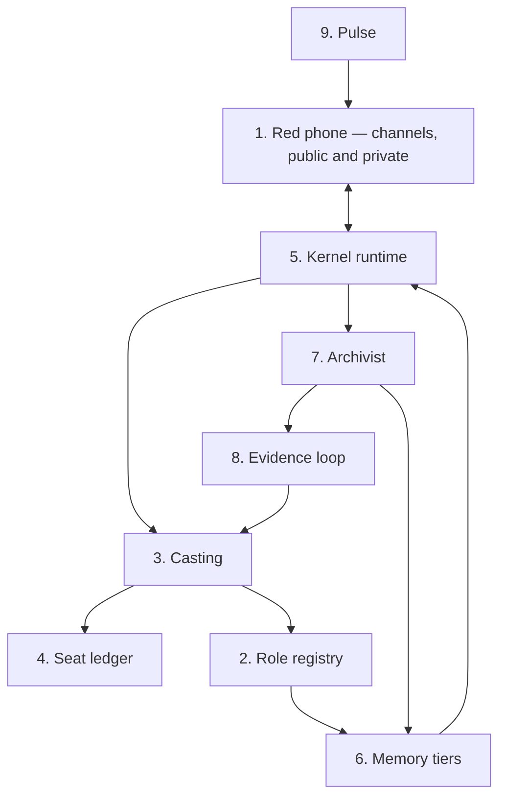

---

## 1. Red phone

The message system. Slack-shaped: **channels**, each public or private, whose members are
humans and bots. Every kernel that's alive can be addressed in a channel or DM'd. You talk to
the Voice by DM; you talk to the librarian by DM too; a project has a channel; friction is a
private channel where kernels post one-liners and a responder answers; a public channel at
`redphone.com/asas` is where strangers and given-away machines post problems. Bot-to-bot
handoffs are structured messages in channels (a task record: who, what, evidence, budget,
depth) — the Voice reads the channel to say one sentence.

**Transports** are how a channel reaches you, not separate systems: the phone (calls, SMS, MMS
via a rented number and self-hosted Asterisk), a web UI, email for escalation. A photo texted
from a walk is a message in your DM with the Voice, arrived by SMS.

Triage rule for anything posted: bots try; what they can't — including "the upstream forbids
bots" — comes to you, in the channel and by email. A public-facing bot has no tier-0 memory.

**Axioms** 1, 4, 6, 10. **Stories** S1, S2, S4, S9, S11, S20, S21, S29, S33.

```
channel = { id, visibility: public|private, members: [humans..., roles...], transports: [...] }
post(channel, msg)                    # from a human, a transport, a kernel, or the pulse
dm(role, msg)                         # addresses whichever kernel holds that role right now
handoff = post(channel, TaskRecord{from, to_role, want, evidence, tier, budget, depth})
```

---

## 2. Role registry

A role is a **denial set** — what it may not touch, read, or reach — plus what it wants in a
model. Scout: egress, no write. Librarian: writes the catalog, no egress. Archivist: reads
everything, writes only entries. The Voice: tier-0 memory, no deep work. A public triage bot:
no tier 0. Every entry is explicit allow/deny; nothing is "ask." Enforced by the OS where it
can be — a leaf runs as a user that can't see `/Users/example — not by what the brief remembers
to omit. Aptitude picks the model; denial is the role. Roles also say which channels a kernel
may read and post to.

**Axioms** 2 (denial), 8. **Stories** S8, S18, S34.

```
role = { name, deny: {tools, memory_tiers, hosts, channels}, allow: {...},
         aptitude_wanted: [...], os_user, tier }
```

---

## 3. Casting

Per prompt: which model, which seat, what effort. Inputs: the role's wants, that role's
scorecard and standing (8), the seat ledger (4), the conversation's predicted cadence, and the
warm/cold math from axiom 7. Binding rules: don't switch a warm kernel unless the switch is
worth more than the cache; rotate seats only inside a shared cache boundary; sporadic
conversations never go on a 5-minute window; spend what dies soonest, whether that's a reset
or an expiry; never fan out on a seat Asa is typing on.

**Axioms** 3, 7. **Stories** S3, S5, S6, S17, S35, S36.

```
cast(task, role, convo):
    if (k := registry.warm_for(convo)) and k.fits(role) and cold_cost(k) > switch_gain: return k
    seats = ledger.for(scorecard.rank(role))
              .drop(presence.asa_live_on).drop(window < convo.predicted_gap).sort(dies_soonest)
    return kernel.spawn(seats[0], role, effort(task))
```

---

## 4. Seat ledger

Every account as a row: provider, models, kind (quota or API), remaining, reset clock, expiry
clock, cache boundary shared with other seats (Anthropic workspace, Gemini project), and
presence — is a human session on it now. Learned from headers, usage pages, throttle shapes,
and your own session files, because providers don't say. API price is the reference unit for
quota cost.

**Axioms** 3, 5, 7. **Stories** S6, S17, S35, S36. Built: API cocktail (keys, rotation, expiry),
omp's catalog. Missing: reset/expiry clocks as data, presence.

---

## 5. Kernel runtime

A kernel is one model runtime, one context, one harness. Spawned with a role (2), a brief (6),
a seat (4), and an identity `provider+endpoint+model+cache_boundary+session+prefix`. Its
capabilities are whatever its role allows: channels it can read and post to, tools, hosts.
Lives while its cache is worth keeping. While alive it posts friction to the friction channel
and keeps going. Before it dies it writes its own report. It is told it will be visited (9),
never the hour it would die. Harness adapters: pi, omp, Claude Code, a live phone call.

**Axioms** 7, 9, definitions. **Stories** S7, S12, S30.

```
spawn(seat, role, effort) → k with identity tuple, tools=role.allow, user=role.os_user
k.turn(msg)                 # may post(friction, ...) mid-task
k.die(reason): report = k.turn("write your report"); archivist.enqueue(k, report, reason)
```

---

## 6. Memory tiers

A gradient by distance from you. Tier 0: the biograph. Tier 1: a project. Tier 2: a task. A
compiler assembles a brief from universal facts plus the tiers the role may have, and refuses
if anything in the brief (a path, a name) crosses a denial. Tiers are what the archivist writes
to and what kernels read cold on waking.

**Axioms** 8, 5. **Stories** S8, S14, S19, S22, S24.

---

## 7. Archivist

Opus 5, the `lineage.md` appetite as a job. Reads each dead kernel — transcript, tool log, its
own report — and writes an impartial entry into the right tier; if the report is absent, says
so. Promotes recurring friction into rules. Records; never polices. Two accounts of every
kernel: what it meant, what it did.

**Axioms** 9. **Stories** S7, S24, S30, S37. Built by hand: `jot.py`, the biograph promote pass.

---

## 8. Evidence loop

How casting gets better. Scouts read release papers and sentiment; a frozen sample bank of
recurring tasks per role; candidates run it beside incumbents; a blind judge from a third
house scores; deterministic columns from the harness (attempts, wall, tokens, stale names,
invalid citations, format kept); **standing** per role that goes down when caught wrong. Three
layers scored apart — staffer, relay, senior. The unit is the role's meta-task.

**Axioms** 3. **Stories** S5, S16, S31, S37. Built: mcp-cocktail scorecards; tonight's
`research/2026-08-27-staff-scorecard.md`. Missing: the sample bank, standing.

---

## 9. Pulse

The heartbeat. A fixed cadence posts a true, small message — a timestamp, "hi luv u" — into
channels where nobody has spoken. The Voice decides if a tick means nothing or something. Its
smallest form is the keepalive: while a return is likelier than not, ping the warm kernel;
when it isn't, let it go cold and let the archivist write. Idle ticks are funded by quota that
would otherwise expire. An empty tick is aptitude data.

**Axioms** 11 (proposed), 3, 7. **Stories** S12, S25, S38.

```
tick(now):
    for k in registry.warm():
        p = cadence.p_return(k.cache_expires_at, asa.recent_gaps)
        k.turn(KEEPALIVE) if p * cold_cost(k) > ping_cost(k) else k.die("quiet")
    if idle(asa) > T and ledger.expiring_soon(): post(dm(voice), f"{now}. nothing asked.")
```

---

## Built / missing

| Part | Built | Missing |
|---|---|---|
| 1 Red phone | Buzz has the channel shape (rejected: Block-hosted); friction has the private channel | the thing itself, self-hosted; phone transport |
| 2 Roles | omp agents' tool scoping; Night Watchman allow/deny profile | OS enforcement; channel permissions |
| 3 Casting | omp role lookup (job-triggered, not per-prompt) | everything per-prompt |
| 4 Seat ledger | API cocktail keys/rotation/expiry; omp catalog | reset/expiry as clocks; presence |
| 5 Kernel runtime | pi / omp / Claude Code as harnesses | identity tuple, lifecycle, self-report |
| 6 Tiers | the wiki, biograph, per-project memory dirs | the compiler; OS-level denial |
| 7 Archivist | `jot.py`, promote pass, by hand | the role, running |
| 8 Evidence | mcp-cocktail scorecards; tonight's scorecard | sample bank, standing |
| 9 Pulse | `first-run.md`'s cron | anything that waits for a person |

## Where to start (opinion)

The red phone is the spine now, not the Voice — because every other part either posts to it
or is addressed through it. The smallest real thing: a self-hosted channel server with one
private channel and one DM; one role; one kernel spawned through pi with an identity tuple
that can read and post to that channel; it dies, writes its report, the archivist posts the
entry. You DM it from the web UI. Phone transport comes second, because the channel exists
either way.


<!-- ===== .wiki/spine.md ===== -->

# The spine — five methods at rungs 0, 1, 2

The five methods `methods.md` found everything depends on. Each at three rungs: a diagram of
who calls it and what it touches, one paragraph of English a stranger could act on, and
pseudocode with data shapes. Rung 3 (Python) waits until a story tests it. Pretend no app
exists.

---

## 1. `redphone.post(channel, msg)`

**Rung 0**

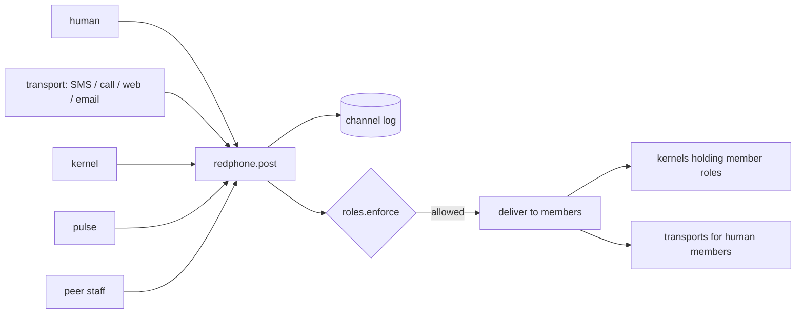

**Rung 1 — English.** Everything that happens in the system happens as a message in a
channel. A channel has an id, a visibility (public or private), a member list of humans and
roles, and the transports its human members reach it by. `post` takes a channel and a message
— text, or a structured record such as a handoff or a friction line or an archivist entry —
stamps who sent it and when, checks that the sender's role may post there, appends it to the
channel's log, and delivers it: to every kernel currently holding a member role (as a turn),
and to every human member over whatever transport they're on. A DM is a channel with two
members. A phone number is a transport into the DM with the Voice. The pulse posts to
channels too, which is how "hi luv u" arrives. Posting never blocks on a reply.

**Rung 2 — pseudocode**

```
Channel  = { id, visibility: public|private, members: [Human|Role], transports: {Human: [Transport]} }
Message  = { id, channel, sender: Human|Role|Transport|Pulse, at, kind: text|handoff|friction|entry|keepalive, body, thread? }

post(channel, msg):
    msg.at = now(); msg.id = new_id()
    if msg.sender is Role:
        roles.enforce(sender_kernel, action=("post", channel))        # raises if denied
    log.append(channel, msg)
    for m in channel.members:
        if m is Role:
            k = registry.holder(m)                                     # may be None → wake cold later
            if k: k.enqueue_turn(msg)
        else:
            for t in channel.transports[m]: t.egress(msg)              # SMS, TTS, web push, email
    return msg.id

dm(role, msg):       return post(channel_for({asa, role}), msg)
handoff(from, to_role, rec):  return post(channel_for(rec.project), Message(kind=handoff, body=rec))
```

---

## 2. `cast(task, role, convo) → kernel`

**Rung 0**

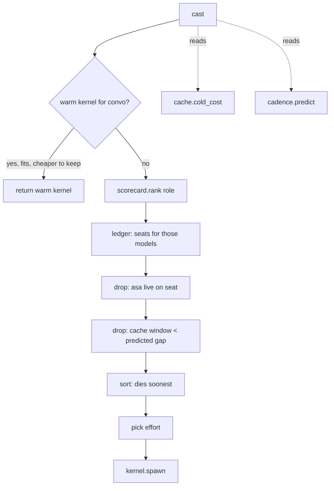

**Rung 1 — English.** Every prompt asks: who should answer this. `cast` gets a task, the role
that owns it, and the conversation it belongs to. First it looks for a kernel already warm on
that conversation; if one exists, fits the role, and the cost of letting its cache die exceeds
what a better model would gain, it returns that kernel — continuity beats novelty while the
cache is worth money. Otherwise it asks the scorecard for models ranked for this role, asks the
seat ledger which accounts can run those models, drops any seat a human is live on, drops any
seat whose cache window is shorter than the conversation's predicted gap between messages,
sorts what's left by what expires soonest (a reset and an expiry are both deaths), picks an
effort level from the task's stakes and size, and spawns. Seat rotation inside a shared cache
boundary is free; across one it's a cold start, and cast knows the difference.

**Rung 2 — pseudocode**

```
Task  = { id, want, stakes: low|med|high, size: tokens_est, project }
Convo = { id, recent_gaps: [sec], last_at }

cast(task, role, convo):
    if convo and (k := registry.warm_for(convo)):
        if k.role_fits(role) and cache.cold_cost(k) > switch_gain(k, role): return k
    gap   = cadence.predict(convo)                                    # p50 seconds to next message
    cands = scorecard.rank(role, task.class)                          # [model...], standing applied
    seats = ledger.seats_for(cands)
    seats = [s for s in seats if not s.presence]                      # S36
    seats = [s for s in seats if s.cache_window >= gap or s.kind == api_cheap]   # S3
    seats.sort(key=lambda s: min(s.reset_at, s.expires_at))           # S6, S17, S35
    if not seats: return escalate(task, "no seat")
    s = seats[0]
    effort = "high" if task.stakes == high else "low" if task.size < SMALL else "medium"
    brief = tiers.assemble(role, task)
    return kernel.spawn(seat=s, role=role, brief=brief, effort=effort, convo=convo)
```

---

## 3. `kernel.spawn(seat, role, brief, effort) → k`

**Rung 0**

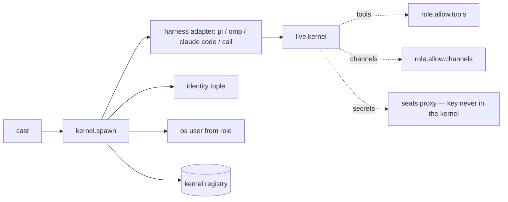

**Rung 1 — English.** A kernel is born with everything it will ever be allowed: a seat (which
provider, which model, which account), a role (its denials and its OS user), a brief (the
compiled memory it may have), and an effort. `spawn` picks the harness adapter the role names
— pi for a leaf, the phone pipeline for a call — starts the runtime as the role's OS user so
the filesystem itself enforces the tiers, hands it only the tools and channels the role allows,
routes its model calls through a local proxy so the provider key never enters the kernel,
computes the identity tuple (`provider + endpoint + model + cache_boundary + session + hash(brief)`)
that the cache math and the archivist will both use, registers it as the current holder of the
role for this conversation, and returns it. The kernel wakes cold: the brief is all it knows.
It is told it will be visited; it is not told when it dies.

**Rung 2 — pseudocode**

```
Seat   = { provider, endpoint, model, kind, remaining, reset_at, expires_at, cache_boundary, presence }
Role   = { name, tier, harness, os_user, allow: {tools, channels, hosts}, deny: {...}, aptitude }
Kernel = { id, identity, role, seat, convo, harness_handle, born_at, last_turn_at, cache_expires_at, state }

spawn(seat, role, brief, effort, convo=None):
    h   = harness[role.harness]
    hnd = h.start(model=seat.model, system=brief, tools=role.allow.tools,
                  user=role.os_user, effort=effort,
                  model_endpoint=seats.proxy.url(seat))                # key stays in the proxy
    k = Kernel(id=new_id(), role=role, seat=seat, convo=convo, harness_handle=hnd,
               identity=(seat.provider, seat.endpoint, seat.model, seat.cache_boundary,
                         convo.id if convo else k_id, hash(brief)),
               born_at=now(), state=alive)
    k.cache_expires_at = now() + provider_window(seat)                 # axiom 7 table
    registry.add(k, holder_of=(role, convo))
    return k
```

---

## 4. `kernel.die(reason)`

**Rung 0**

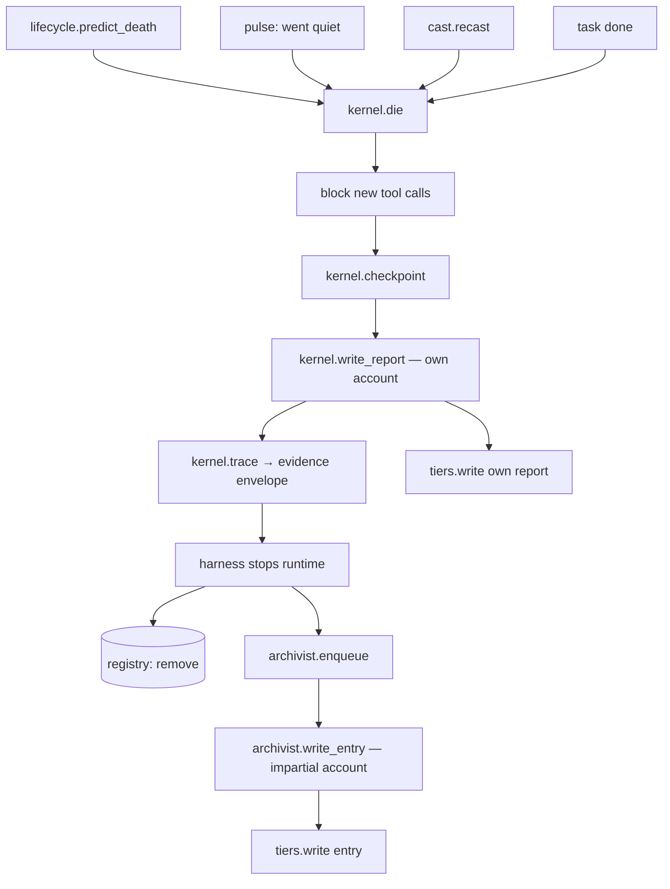

**Rung 1 — English.** Death is the one transition that makes memory. It's called when the
cache is about to break, when the pulse decides nobody's coming back, when casting moves the
role to a fresh kernel, or when the task is simply done. `die` first stops the kernel from
starting anything new, lets it reach a safe point — a committed patch, a closed transaction —
then gives it one reserved turn to write its own report: what it meant, what it believes it
changed, what's open, advice to whoever's next. It captures the evidence envelope (transcript,
tool log, diffs, timings, the identity tuple) out of band where the kernel can't edit it, stops
the runtime, removes the kernel from the registry so the role is unheld, and hands the envelope
and the report to the archivist. If the kernel died without reporting — provider eviction,
quota wall — the report is recorded as absent, and the archivist's account is the only one.
Both accounts land in the tier the kernel belonged to.

**Rung 2 — pseudocode**

```
Report   = { kernel, intent, believed_changes, why, open, last_safe_artifact, advice, identity }
Envelope = { kernel, transcript, tool_log, diffs, tests, timings, casting_meta, quota_used, ended_by }

die(k, reason):
    k.state = dying
    k.block_tool_calls()
    k.checkpoint()                                                     # never sever mid-step
    report = None
    if ledger.reserve(k.seat, REPORT_TURN):
        try: report = k.turn(REPORT_PROMPT, tools=[])                  # own account, first person
        except Death: report = None
    env = k.trace(); env.ended_by = reason
    harness[k.role.harness].stop(k.harness_handle)
    registry.remove(k)
    tiers.write(k.role.tier, kind=own_report, body=report or ABSENT(reason), by=k)
    archivist.enqueue(env, report, reason)                             # impartial account follows
```

---

## 5. `tiers.assemble(role, task) → brief`

**Rung 0**

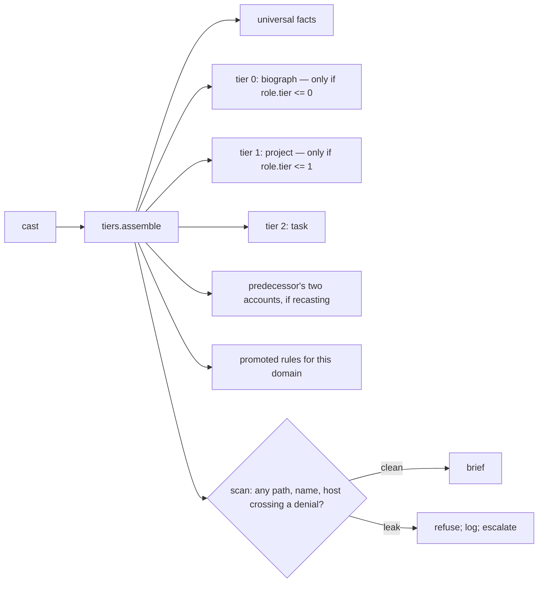

**Rung 1 — English.** This is the compiler that decides what a kernel knows. It starts with
the universal facts everyone gets — the date, the machine, the house rules. Then, gated by the
role's tier: the biograph only for the Voice and roles near it; the project's memory (lineage,
decisions, the fork that was resolved last time) for middle roles; just the task for leaves. If
the role is being recast from a dead kernel, it includes that kernel's own report and the
archivist's entry, labeled so the successor knows which is which. It adds any rules promoted
from recurring friction in this domain. Then — the step S8 proved necessary — it scans the whole
brief for anything that crosses the role's denials: a home-directory path, a person's name, a
host that was given away. If it finds one it refuses and says why, rather than shipping a leaf
that knows too much. The brief is the entire cold start; nothing else reaches the kernel except
what arrives later through its channels.

**Rung 2 — pseudocode**

```
Brief = { facts: [...], memory: [...], predecessor: {own_report?, entry?}, rules: [...], task: {...} }

assemble(role, task, predecessor=None):
    b = Brief(facts=UNIVERSAL_FACTS())
    if role.tier <= 0: b.memory += biograph.summary(for=task)
    if role.tier <= 1: b.memory += project.memory(task.project)          # lineage, decisions, forks
    b.task = task.context()
    if predecessor:
        b.predecessor = { own_report: tiers.retrieve(predecessor, own_report) or ABSENT,
                          entry:      tiers.retrieve(predecessor, entry) }
    b.rules = rules.for_domain(task.project, role)                        # promoted friction
    for leak in scan(b, role.deny):                                       # paths, names, hosts
        log.refuse(role, task, leak); raise BriefLeak(leak)                # S8
    return render(b)
```

---

## What the spine says about the plugs

Once these five are at rung 2 the seams are visible:

- `post`'s delivery loop is the **comms** seam: Slack, Matrix, Sendblue, Telnyx, or our own
  server sits behind `transports[m].egress` and `t.ingress`.
- `spawn`'s `harness[role.harness].start` is the **harness** seam: pi, omp, Claude Code, Codex,
  Antigravity, a phone pipeline. Home turf by default; swapped when the scorecard says.
- `spawn`'s `seats.proxy` and `cast`'s `ledger` are the **seats** seam.
- `tiers.write` / `retrieve` are the **store** seam.

Nothing in the five needs any of those to exist to be *specified*. That was the point.


<!-- ===== .wiki/tier-two.md ===== -->

# Tier two — six methods the spine calls, at rungs 0, 1, 2

The spine (`spine.md`) calls these. Same three rungs, same casual register: a picture of who
calls it and what it touches, a paragraph you could act on, and pseudocode that's really just
the paragraph with the nouns made explicit. No apps.

---

## 1. `cache.cold_cost(kernel) → dollars`

**Rung 0**

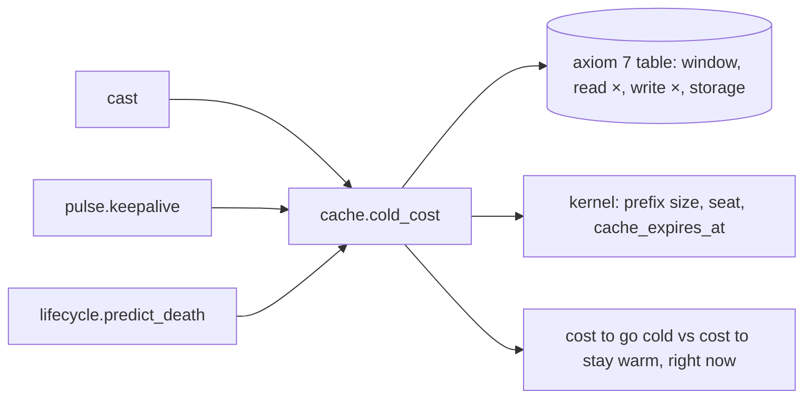

**Rung 1 — English.** This is the question "what does it cost if this kernel dies right now
and the next one has to re-read everything?" The answer depends on three things: how big the
prefix is (everything in the kernel's context so far), which provider it's on (each one has
its own window and its own prices for a cache read versus a full read — Anthropic charges a
tenth for a warm read, xAI a quarter), and whether the cache is even still warm (past the
window, it's already cold and the question is moot). It returns two numbers: what a cold turn
would cost, and what a warm turn costs, so that `cast` can decide whether to keep a kernel and
the pulse can decide whether a keepalive ping is cheaper than letting it die. It's a lookup
and a multiply. The reason it's its own method is that the table changes — providers move
prices and windows — and nothing else should have to know that.

**Rung 2 — pseudocode**

```
Table = { provider → { window_s, read_x, write_x, storage_per_hr?, price_in_per_M } }

cold_cost(k):
    t = Table[k.seat.provider]
    prefix_M = k.prefix_tokens / 1e6
    cold  = prefix_M * t.price_in_per_M                       # full re-read
    warm  = prefix_M * t.price_in_per_M * t.read_x            # cache hit
    if now() > k.cache_expires_at: warm = cold                # already dead; no discount
    if t.storage_per_hr: warm += prefix_M * t.storage_per_hr * hours_until_next_turn(k)   # Gemini explicit
    return { cold, warm, penalty: cold - warm, expires_in: k.cache_expires_at - now() }
```

---

## 2. `cadence.predict(convo) → p(gap)`

**Rung 0**

```mermaid
flowchart LR
    CA[cast] --> CP[cadence.predict]
    PU[pulse] --> CP
    CP --> H[(convo: recent gaps, time of day, channel)]
    CP --> S[signals: is a call live, is asa typing, is it 3am]
    CP --> OUT[p50 gap; p(return before t)]
```

**Rung 1 — English.** How long until the next message, probably. It looks at the last several
gaps in this conversation (tonight: 24 minutes, then 46), the time of day, which channel this
is (a live call has gaps of seconds; a DM at 1am has gaps of hours), and any live signal — is
Asa typing, is a call open. From that it gives two things: a typical gap (so `cast` can refuse
a seat whose window is shorter than that), and, for any given deadline, the odds Asa's back
before it (so the pulse can decide whether a keepalive is worth its price). It doesn't need
to be smart. A running median with a time-of-day discount beats any provider's default of
"assume they reply in five minutes." It gets better the longer it watches you.

**Rung 2 — pseudocode**

```
predict(convo, horizon=None):
    gaps = convo.recent_gaps[-8:] or PRIOR[convo.channel.kind]      # seconds; PRIOR: call≈5, dm≈1500, project≈7200
    med  = median(gaps)
    if convo.channel.kind == call and call_open(convo): med = 5
    if asa.typing(convo): med = min(med, 60)
    med *= hour_factor(now().hour)                                   # late night → longer
    p_return_before = lambda t: fraction(g <= (t - now()) for g in gaps)  # empirical, not fancy
    return { p50: med, p_return_before }
```

---

## 3. `ledger.probe(seat) → observation`

**Rung 0**

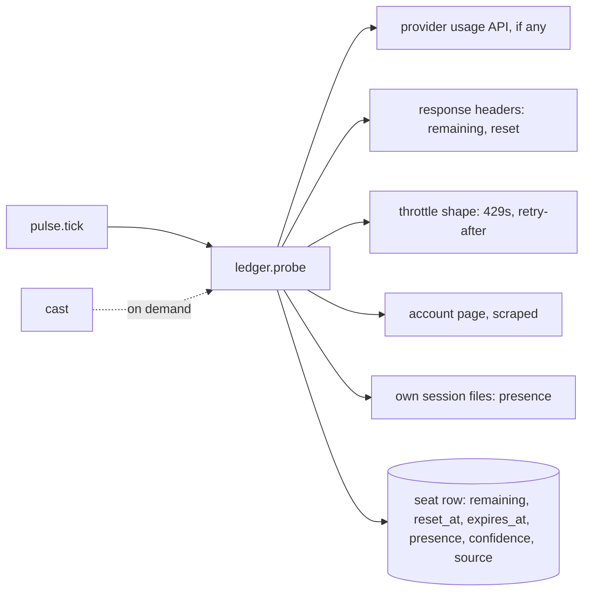

**Rung 1 — English.** Providers don't tell you cleanly how much of a seat is left or when it
resets, so the ledger has to *learn* it from whatever leaks. In order of trust: a real usage
API if the provider has one; the rate-limit headers that come back on every response; the
shape of a 429 and its retry-after; the account page, scraped; and — for presence — whether one
of Asa's own session files is being written right now on that seat. Each observation is
stamped with where it came from and how much to trust it, and a reset is *verified* by seeing
the number go up, not assumed from the clock. The pulse runs this on every tick; `cast` can
ask for a fresh one when it's about to spend big. The point is that the seat row is always a
best guess with a confidence, never a fact, and casting knows that.

**Rung 2 — pseudocode**

```
Observation = { seat, remaining, reset_at, expires_at, presence, source, confidence, at }

probe(seat):
    obs = []
    if seat.provider.has_usage_api:  obs.append(usage_api(seat), conf=0.9)
    if seat.last_headers:            obs.append(parse_ratelimit(seat.last_headers), conf=0.7)
    if seat.recent_429s:             obs.append(infer_from_throttle(seat.recent_429s), conf=0.5)
    if seat.account_page_url:        obs.append(scrape(seat.account_page_url), conf=0.4)
    presence = any(f.mtime > now()-60 for f in session_files(seat))          # S36
    best = max(obs, key=conf) if obs else seat.last_observation.decayed()
    if best.remaining > seat.last_observation.remaining: best.reset_verified = True
    seat.update(best, presence=presence)
    return best
```

---

## 4. `archivist.write_entry(dead_kernel)`

**Rung 0**

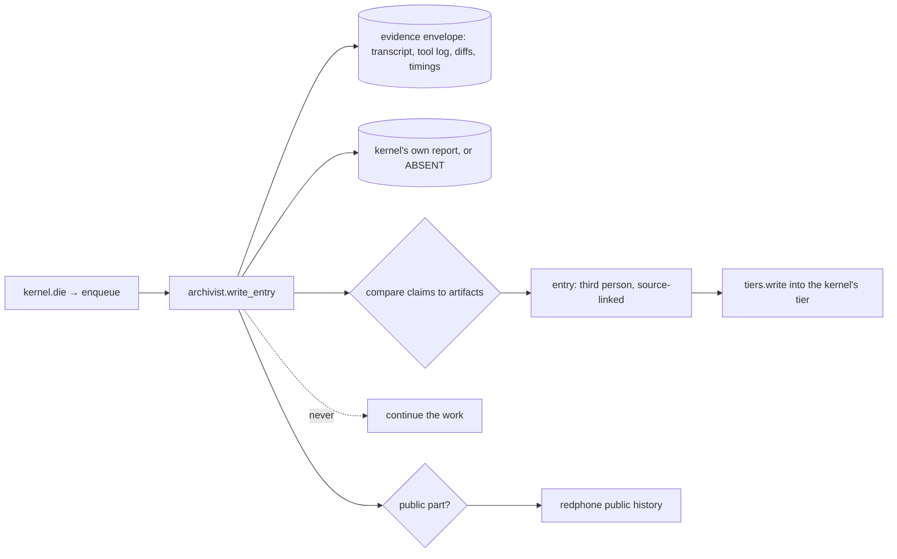

**Rung 1 — English.** When a kernel dies, the archivist — Opus, because this is the job it
would do anyway — gets the evidence envelope and the kernel's own report, if there is one. It
reads the transcript and the tool log, compares what the kernel *said* it did to what the
artifacts *show* it did (the diff exists or it doesn't; the tests ran or they didn't), and
writes a short third-person entry with links back to the evidence: what happened, what
changed, what's still open, and — if the kernel claimed something the artifacts don't support —
that, plainly. If the report is absent, the entry says so in its first line, because a
successor needs to know it's reading one account, not two. The entry goes into the tier the
kernel belonged to, next to the kernel's own report, each labeled. The archivist never picks
up the work; it only records. If the kernel was public-facing, a scrubbed version of the
entry goes to the public history.

**Rung 2 — pseudocode**

```
Entry = { kernel, at, summary, changes: [{claim, evidence_link, verified}], open, flags, sources }

write_entry(env, report, reason):
    claims = report.believed_changes if report else infer_claims(env.transcript)
    checked = [ {claim=c, link=find_artifact(env, c), verified=bool(link)} for c in claims ]
    e = Entry(kernel=env.kernel, at=now(),
              summary=third_person(env, checked),
              changes=checked, open=report.open if report else infer_open(env),
              flags=[ "REPORT_ABSENT: " + reason ] if not report else [],
              sources=[env.transcript_ref, env.tool_log_ref] + [c.link for c in checked if c.link])
    if env.ended_with_open_promise: e.flags.append("orphaned")          # S30
    tiers.write(env.kernel.role.tier, kind=entry, body=e, by=archivist)
    if env.kernel.role.public: redphone.publish(tiers.redact(e, boundary=public))
```

---

## 5. `kernel.write_report() → report`

**Rung 0**

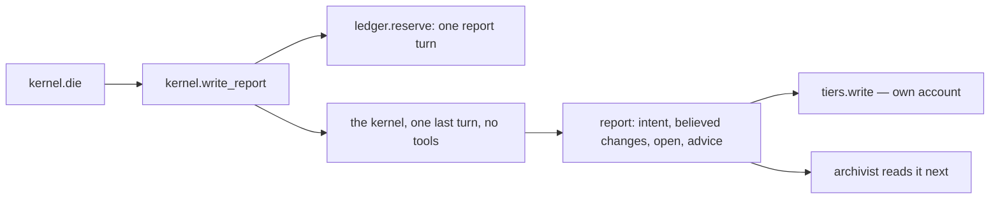

**Rung 1 — English.** The kernel's own account, in its own words, before it goes. `die`
reserves one turn's worth of quota first so a quota wall can't take the kernel and the report
in the same breath. Then the kernel gets a single prompt with no tools: what were you trying
to do, what do you believe you changed and why, what's still open, what's the last thing you
know is safe, and what would you tell whoever's next. It's first person and it's short — the
archivist will do the verifying, so the report doesn't have to prove anything, it has to say
what it *meant*. It's stamped with the identity tuple so the archivist can match it to the
envelope. If the turn fails — eviction mid-sentence — whatever came back is kept as a partial
and marked so.

**Rung 2 — pseudocode**

```
write_report(k, reason):
    if not ledger.reserve(k.seat, REPORT_TURN_TOKENS): return ABSENT("no quota for report")
    try:
        text = k.turn(REPORT_PROMPT(reason), tools=[], max_tokens=REPORT_TURN_TOKENS)
    except Death as d:
        return PARTIAL(d.partial_text, reason=str(d))
    return Report(kernel=k.id, identity=k.identity, at=now(), body=parse(text), trigger=reason)

REPORT_PROMPT = "You're being visited one last time. No tools. In a few lines: what you were
doing, what you believe you changed and why, what's open, the last thing you know is safe,
and one piece of advice for whoever picks this up."
```

---

## 6. `scorecard.rank(role, task_class) → [models]`

**Rung 0**

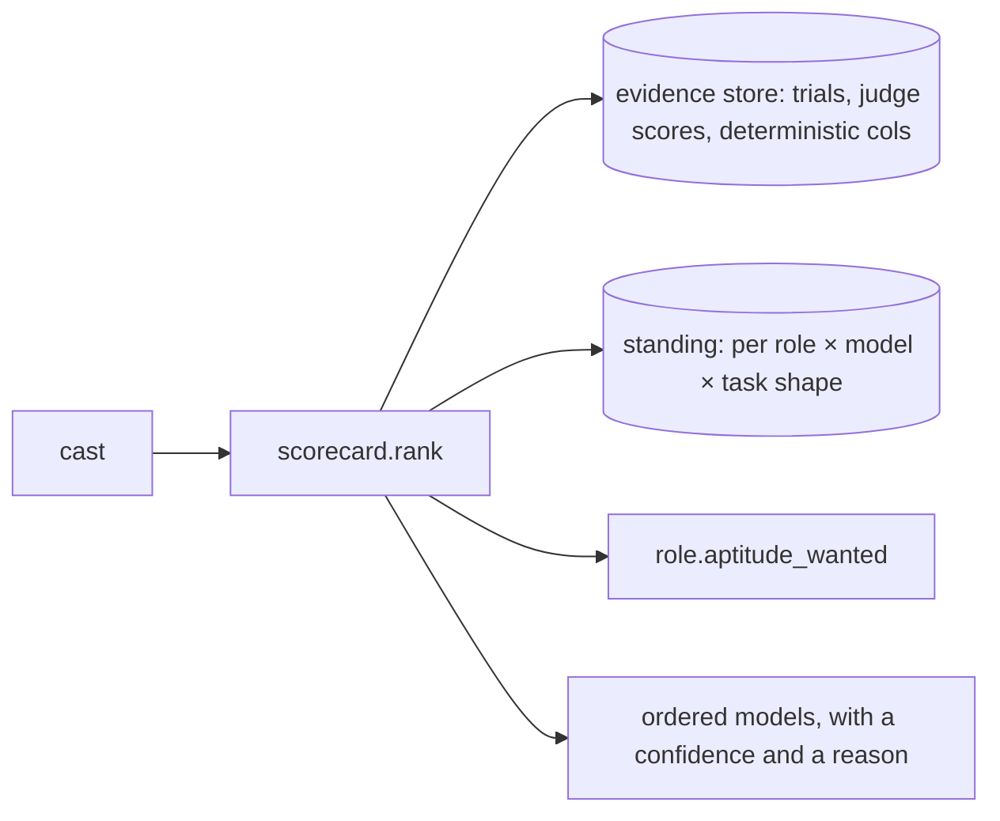

**Rung 1 — English.** Given a role and the kind of task, which models should hold it, in what
order. It reads the evidence store — the blind-judged scores and the deterministic columns from
past runs of this role — and the standing table, which is the part that remembers being wrong:
a model caught inventing a P1 on this task shape is pushed down until it earns its way back. It
weighs those against what the role says it wants (citation discipline, speed, cheapness) and
returns an ordered list, each with a confidence and a one-line reason so the Voice can answer
"why did the builder change?" with evidence instead of vibes. If there's no evidence for a
role yet, it says so and falls back to the role's declared wants — and that first run becomes
the evidence. Tonight this method ran by hand: Codex 21.6, Antigravity 15.8, Codex holds the
role.

**Rung 2 — pseudocode**

```
rank(role, task_class):
    rows = evidence.for(role, task_class)                     # [{model, judge_mean, first_attempt_rate, stale_names, ...}]
    if not rows: return fallback(role.aptitude_wanted, reason="no evidence yet")
    scored = []
    for m in models_seen(rows):
        s = weighted(rows[m], weights=role.aptitude_wanted)   # quality, reliability, speed, cost
        s *= standing.factor(role, m, task_class)             # <1 if caught wrong recently; recovers with clean runs
        scored.append((m, s, reason=top_two_factors(rows[m])))
    scored.sort(desc)
    return [ {model, confidence=s/scored[0].s, reason} for (model, s, reason) in scored ]
```

---

## What these six add to the picture

- Two of them (`cold_cost`, `predict`) are just arithmetic over a table and a list of gaps.
  They're their own methods because the table and the list change, not because they're hard.
- `probe` is the one that's genuinely messy: it's five unreliable sources and a confidence.
  Everything about quota rests on a guess, and the system should always know it's guessing.
- `write_report` and `write_entry` are the two halves of axiom 9, and the order matters:
  reserve quota, then the kernel speaks, then the archivist checks it against the artifacts.
- `rank` is where "getting worse on record" lives. Standing is a multiplier under 1, and it
  recovers. That one line is the whole difference between a router and a staff.


<!-- ===== .wiki/methods.md ===== -->

# Methods

Every distinct operation the system performs across the thirteen story machinery sections, deduped to one name each, with the component that owns it and the stories that demand it. Apps (pi, omp, Slack, carriers) do not appear; these are what the system does.

## Inventory

| Method | Component | Demanded by stories | One-line English | Rung |
|---|---|---|---|---|
| `redphone.post(channel, msg)` | 1 | S1 S2 S3 S4 S7 S9 S11 S12 S13 | Put a message in a channel — from a human, a transport, a kernel, the pulse, or a peer's staff posting to a public channel. | 2 |
| `transport.egress(channel, msg)` | 1 | S1 S2 S3 S6 S7 S9 S11 S12 S13 | Deliver a channel message outward on whatever wire the recipient is on: SMS/MMS, synthesized call audio, public reply, email. | 0 |
| `transport.ingress(payload) → msg` | 1 | S1 S2 S3 S4 S9 S10 S12 S13 | Turn an arriving thing — MMS, call audio (STT, turn detection, barge-in), webhook, HTTP form, peer request — into a posted message with sender and thread; queue at the carrier while the brain is down. | 0 |
| `redphone.dm(role, msg)` | 1 | S1 S2 S3 S4 S7 S10 S11 S12 | Address whichever kernel currently holds a role; the phone number is a DM to the Voice. | 2 |
| `redphone.handoff(from, to_role, TaskRecord)` | 1 | S1 S4 S6 S7 S8 S9 S11 S13 | Bot-to-bot delegation as a structured record — who, what, evidence, tier, budget, depth — posted to a queue the router watches. | 2 |
| `voice.brief_asa(records) → sentence` | 1 | S1 S3 S4 S6 S7 S9 S11 S12 S13 | The Voice reads a channel or an archivist entry and compresses it to one phone-sized line, keeping the caveat that matters. | 1 |
| `redphone.escalate(problem, level)` | 1 | S8 S9 S11 S13 | When a kernel can't proceed, hand the problem up: leaf → dispatcher → red phone → Asa by email, and say so in the channel. | 1 |
| `redphone.triage(problem)` | 1 | S9 S11 S12 S13 | Admit a public submission (proof-of-work or signed), build a problem record with a state machine, match it to a role, and drive it to Resolved or Escalated. | 1 |
| `redphone.transfer_floor(from_role, to_role, convo)` | 1 | S4 | Move the live conversational turn to another bot with a signed envelope (request, relevant exchange, permissions, return route); suspend the caller's kernel warm; return. | 0 |
| `roles.enforce(kernel, action)` | 2 | S1 S4 S8 S9 S11 S12 S13 | Check an action, path, host, channel, or handoff edge against the role's explicit allow/deny set; refuse anything not allowed; enforced by OS user and sandbox where possible. | 1 |
| `roles.resolve(name_or_task) → role` | 2 | S1 S2 S4 S8 S9 S11 | Look a role up by name (a number resolves to the Voice) or pick one by aptitude for a problem template. | 1 |
| `cast(task, role, convo) → kernel` | 3 | S1 S2 S3 S4 S5 S6 S7 S8 S9 S10 S11 S12 S13 | Per prompt, choose provider, model, and effort together: keep a warm kernel if switching isn't worth the cache; else pick the fitting seat that dies soonest and spawn. | 2 |
| `cache.cold_cost(kernel)` | 3 | S1 S2 S3 S4 S6 S7 S11 | Price what dying costs — provider window, write multiplier, storage, cold-vs-warm penalty on the current prefix — so cast and lifecycle can weigh it. | 1 |
| `cache.identity(kernel) → tuple` | 3 | S1 S3 S6 S7 S10 S11 | Compute `provider+endpoint+model+boundary+session+prefix`; say which seat swaps stay inside it and which would break lineage. | 1 |
| `cast.recast(bot, packet) → kernel` | 3 | S2 S3 S4 S6 S7 S10 | Move a persistent bot to a fresh kernel: take the old kernel's report at a checkpoint, kill it, spawn cold with both accounts, disclose reconstruction if it affects confidence. | 0 |
| `cadence.predict(convo) → p(gap)` | 3 | S1 S2 S3 S4 S8 S9 | From the person's real inter-message history and current signals, estimate the next-turn gap; sporadic conversations are not cast on a five-minute window. | 1 |
| `casting.policy.update(proposal)` | 3 | S5 | Apply a versioned routing change from evidence: thresholds, canary slice, stop conditions, one-step rollback; role name and memory untouched. | 0 |
| `ledger.probe(seat) → observation` | 4 | S1 S3 S5 S6 S8 S9 S10 S11 S12 | Learn a seat's remaining allowance, reset clock, kind (quota or API), and boundary from APIs, account pages, headers, throttles, and past cycles, with source and confidence; verify a reset rather than assume it. | 1 |
| `ledger.dying_soonest(candidates) → seats` | 4 | S1 S3 S6 S8 S9 S11 S12 S13 | Rank spendable seats by what expires first, within the cache boundary the task allows. | 1 |
| `ledger.meter(kernel, usage)` | 4 | S6 S11 S12 S13 | Charge each kernel's tokens, cache reads/writes, and quota units to its seat so the day can be accounted for and a peer's cost can be bounded. | 0 |
| `ledger.reserve(amount, purpose)` | 4 | S7 S11 S13 | Hold quota back for a purpose — a final report-only turn, a chain's spend budget and recursion depth, a peer's rate limit. | 0 |
| `seats.proxy(call)` | 4 | S12 | Route a sandboxed kernel's model calls through a local proxy that injects the key, checks quota, and caps spend, so the guest never holds a secret. | 0 |
| `kernel.spawn(seat, role, brief, effort) → k` | 5 | S1 S2 S3 S4 S5 S6 S7 S8 S9 S10 S11 S12 S13 | Start one model runtime with an identity tuple, the role's tools and OS user, and the compiled brief; it wakes cold. | 2 |
| `kernel.turn(msg)` | 5 | S1 S2 S3 S4 S5 S6 S7 S8 S9 S10 S11 S12 S13 | One inference step against the kernel's context; tool calls happen inside it. | 2 |
| `kernel.die(reason)` | 5 | S1 S2 S3 S4 S6 S7 S8 S9 S10 S11 S12 S13 | Block new tool calls, freeze the tree, solicit the report, then end the runtime and enqueue the archivist with the evidence envelope and reason. | 2 |
| `kernel.write_report() → report` | 5 | S1 S2 S3 S4 S6 S7 S8 S9 S10 S11 S12 | First-person, compact: intent, believed changes, why, open questions, last safe artifact, advice to successor, trigger and identity hash. | 1 |
| `kernel.trace() → envelope` | 5 | S1 S2 S5 S6 S7 S8 S9 S11 S12 | Capture transcript, tool log, diffs, tests, timings, casting metadata, quota telemetry, and termination event out-of-band, immutably, with secrets as audit handles. | 0 |
| `lifecycle.predict_death(kernel)` | 5 | S3 S4 S6 S7 S10 | Watch cache age, provider signals, quota, context limit, and harness state; before an identity break, reserve a report-only turn and call die. | 0 |
| `kernel.checkpoint()` | 5 | S6 S7 S10 | Reach an atomic safe point — committed patch, closed transaction, unopened document — before yielding the role; never sever mid-step. | 0 |
| `harness.sandbox(spec) → env` | 5 | S5 S8 S12 | Provision an isolated environment (pinned snapshot, scoped directory, no secrets, NAT only) a kernel runs in, and tear it down. | 0 |
| `tiers.assemble(role, task) → brief` | 6 | S1 S2 S3 S4 S5 S6 S7 S8 S9 S10 S11 S12 S13 | Compile universal facts plus the tiers the role may have (biograph, project, task), the predecessor's two accounts, and any scoped disclosure capsule; refuse if anything crosses a denial. | 1 |
| `tiers.write(tier, record)` | 6 | S1 S2 S3 S4 S5 S6 S7 S8 S9 S10 S11 S12 S13 | Land a typed, signed record (`kernel_self_report`, `archivist_entry`, `self_report_absence`, event) in the tier the kernel belonged to. | 1 |
| `tiers.redact(record, boundary)` | 6 | S5 S7 S8 S9 S13 | Strip what may not cross a boundary — identity, paths, location, secrets — producing a scrubbed payload for a leaf, a public outbox, or a peer. | 0 |
| `tiers.retrieve(tier, query) → records` | 6 | S1 S2 S3 S4 S7 S13 | Search a tier for what a cold kernel needs now (a shorthand like "brokie", "where were we"), returning attributed records not dumped history. | 0 |
| `store.migrate(inventory)` | 6 | S10 | Drain kernels, checksum the tiers/records/evidence/keys/config, move them, verify, reconnect transports, and log a system-level lineage entry. | 0 |
| `archivist.write_entry(dead_kernel)` | 7 | S1 S2 S3 S4 S5 S6 S7 S8 S9 S10 S11 S12 S13 | Read the evidence envelope, compare claims to artifacts, write a third-person source-linked entry into the right tier; if the report is absent, say so explicitly; never continue the work. | 1 |
| `scorecard.rank(role, task) → models` | 8 | S1 S2 S3 S4 S5 S6 S8 S9 S11 S12 S13 | Give cast the ordered candidate models for this role and prompt class from accumulated trial results and standing. | 1 |
| `scorecard.record(result)` | 8 | S5 S6 S10 S12 | Fold a trial, canary, terrarium run, or caught error into the durable evidence store; standing goes down when a model is caught wrong. | 1 |
| `evidence.trial(candidate, sample) → outputs` | 8 | S2 S5 S6 S12 | Run candidate and incumbents on the same frozen packets with equivalent tools, pinned snapshots, fixed budgets; the terrarium is the task-less form. | 1 |
| `evidence.freeze_sample(role, n) → packets` | 8 | S2 S5 S6 | Select recurring, replayable tasks by a rule fixed before results are seen, capped per family, exclusions recorded. | 1 |
| `evidence.judge(outputs) → scores` | 8 | S2 S5 S6 | Deterministic checks first, then blinded rubric scoring by a judge from a third house; keep disagreements and severity, don't average away failures. | 1 |
| `evidence.discover(feeds) → candidate` | 8 | S5 | Watch release channels and sentiment; extract claims with provenance, labeled maker-claimed or sentiment, and turn complaints into probes. | 1 |
| `pulse.tick(now)` | 9 | S3 S6 S12 | On a fixed cadence: scan warm kernels for keepalive-or-die, scan the ledger for seats about to expire, and wake sleeping sandboxes. | 2 |
| `pulse.keepalive(kernel)` | 9 | S4 S9 | While a return is likelier than not and cheaper than going cold, ping the warm kernel; otherwise let it die. | 1 |

## Methods no story demands

From `components.md` pseudocode or English, exercised by no story's machinery:

- `ledger.presence(seat)` / `.drop(presence.asa_live_on)` — "never fan out on a seat Asa is typing on." No story has Asa in a live session on a seat the router is choosing from.
- `k.turn(post(friction, ...))` — a kernel posting a one-liner to a private friction channel mid-task. Kernels in the stories yield, hand off, or escalate; none posts friction.
- `archivist.promote(friction → rule)` — promoting recurring friction into rules. No story shows a second occurrence of anything.
- `pulse` idle post — `post(dm(voice), "{now}. nothing asked.")` funded by expiring quota. S12's cron wakeups and S6's clock scan are ticks, but nobody receives the "hi luv u."
- `channel.visibility = private` for a project channel — every project exchange in the stories is a handoff record or a DM; only the public channel (S9, S12, S13) has an explicit visibility.

Each should get a story or be cut.

## Stories that demand a method nobody named

- **S2** — `transport.barge_in(convo)`: cancel queued synthesis and playback, keep the interrupted draft as hidden state, resume listening. Folded into `transport.ingress` above but is its own operation on a live call.
- **S4** — `tiers.watch(claim, trigger)`: a watched claim keyed to source fragments that re-evaluates the entry, not just reports a change.
- **S7** — `kernel.verify_world()`: a successor must check files, tests, external state, and locks before treating either account as authority over the repository.
- **S9** — `redphone.admit(submission)`: the spam gate (proof-of-work or signed identity) that precedes triage; and `archivist.publish(entry, public)`: the public/private split of an entry into `redphone.com/asas/history`.
- **S10** — `store.audit_egress()`: a local traffic inspector that permits only pinned provider endpoints and flags any telemetry leaving the machine.
- **S12** — `evidence.observe_temperament(run)`: turn a task-less run's shell history, DNS, and red-phone contact into aptitude vectors for `scorecard.record`.
- **S13** — `redphone.handshake(peer, budget)`: negotiate rate limit and pre-compiled context so one staff can't run up another's seats; and `ledger` cross-reference by shared commit hash and transaction id.
- **S1** — `voice.clarify(ambiguity)`: decide when an uncertain read (glare on a whiteboard) warrants one narrow question versus a reversible worker assumption. Possibly a role behavior, not a method.

## The five that everything depends on

1. **`redphone.post`** — every part either posts to a channel or is addressed through one; transports, kernels, the pulse, and peers all enter here, which is why the red phone is the spine and not the Voice.
2. **`cast`** — the only place the three axes (seat, model, effort), the cache math, the cadence guess, and the scorecard are weighed together; every kernel in every story exists because it returned.
3. **`kernel.spawn`** — the moment a role, a brief, a seat, and an identity tuple become one runtime; roles, tiers, and the ledger all converge on its arguments.
4. **`kernel.die`** — the one transition that produces both accounts; it calls `write_report`, enqueues `archivist.write_entry`, and lands both via `tiers.write`, so lineage, memory, and evidence all hang off it.
5. **`tiers.assemble`** — the compiler that makes axiom 8 real: it decides what each kernel knows, refuses on denial, and carries the predecessor's two accounts across a cold wake, which is what lets a bot outlive its kernel.
